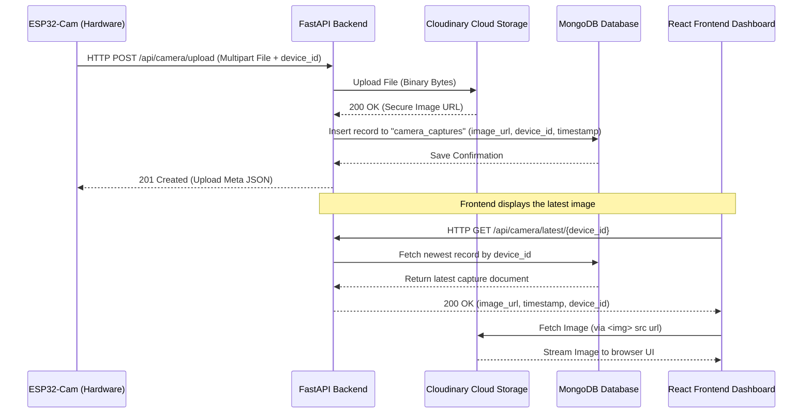

# Product Requirement Document (PRD)
## ESP32-Cam Live Capture: Cloudinary Upload & Frontend Viewer

---

## 1. Project Overview & Goal
The goal of this feature is to allow the **ESP32-Cam** hardware module to capture images (e.g., in case of emergency alerts or snapshots), upload them dynamically to **Cloudinary** (via our FastAPI backend), store the generated URL in **MongoDB**, and display the image in real-time on the **React Frontend Dashboard**.

This document serves as the design and technical blueprint for the **Frontend Developer** to build the image viewer component and integrate it with the backend API.

---

## 2. Architecture & Data Flow



---

## 3. Backend API Specifications

### 3.1. Upload Image (For ESP32-Cam)
* **Endpoint:** `POST /api/camera/upload`
* **Content-Type:** `multipart/form-data`
* **Query Parameters:**
  * `device_id` (string, optional, default: `"device_001"`): The unique hardware ID of the bike's blackbox.
* **Form-Data Request Body:**
  * `file`: The binary JPEG image file captured by the camera.
* **Successful Response (201 Created):**
  ```json
  {
    "capture_id": "8d3e9112-9c4c-423c-bb45-cf8b2b627702",
    "device_id": "device_001",
    "image_url": "https://res.cloudinary.com/demo/image/upload/v1612345678/novashields_esp32/abc123xyz.jpg",
    "created_at": "2026-08-05T04:43:55.123456+00:00"
  }
  ```

### 3.2. Fetch Latest Image (For Frontend)
* **Endpoint:** `GET /api/camera/latest/{device_id}`
* **Response (200 OK):**
  ```json
  {
    "capture_id": "8d3e9112-9c4c-423c-bb45-cf8b2b627702",
    "device_id": "device_001",
    "image_url": "https://res.cloudinary.com/demo/image/upload/v1612345678/novashields_esp32/abc123xyz.jpg",
    "created_at": "2026-08-05T04:43:55.123456+00:00"
  }
  ```
* **Error Response (404 Not Found):**
  ```json
  {
    "detail": "No image captures found for device device_001."
  }
  ```

---

## 4. ESP32-Cam Code Guide (For Reference)
If the hardware developer needs to implement the camera upload request, they can use this Arduino/C++ blueprint:

```cpp
#include <WiFi.h>
#include <HTTPClient.h>

const char* ssid = "YOUR_WIFI_SSID";
const char* password = "YOUR_WIFI_PASSWORD";
const char* serverUrl = "https://your-backend-app.onrender.com/api/camera/upload?device_id=device_001";

void uploadImage(uint8_t* fb_buf, size_t fb_len) {
  if (WiFi.status() == WL_CONNECTED) {
    HTTPClient http;
    http.begin(serverUrl);
    
    // Set headers for multipart/form-data
    String boundary = "----ESP32CamBoundary";
    http.addHeader("Content-Type", "multipart/form-data; boundary=" + boundary);
    
    // Construct Multipart Body
    String bodyStart = "--" + boundary + "\r\n" +
                       "Content-Disposition: form-data; name=\"file\"; filename=\"capture.jpg\"\r\n" +
                       "Content-Type: image/jpeg\r\n\r\n";
    String bodyEnd = "\r\n--" + boundary + "--\r\n";
    
    size_t totalLen = bodyStart.length() + fb_len + bodyEnd.length();
    
    // Send POST request
    int httpResponseCode = http.sendRequest("POST", (uint8_t*)bodyStart.c_str(), bodyStart.length());
    // Note: To stream binary data, write chunks containing the frame buffer followed by bodyEnd
    
    http.end();
  }
}
```

---

## 5. Frontend UI/UX Requirements
To fit the **NovaShields** theme (Sleek, Premium, Dark Cyberpunk / Modern Glassmorphic style), the frontend component should be designed with the following guidelines:

1. **Card Layout & Glassmorphism:**
   * Container should have a semi-transparent dark background (`bg-slate-900/60 backdrop-blur-md`), border (`border-slate-800`), and rounded corners (`rounded-2xl`).
2. **Live Feed Status Indicator:**
   * A blinking green dot at the top-left of the feed box indicating: `"● LIVE CAMERA SNAPSHOT"`.
3. **Capture Timestamp:**
   * Display when the image was captured, converted to local time (e.g. `Captured: Just Now` or `Captured: 2 mins ago` using a helper or library like `date-fns`/`moment`).
4. **Interactive Features:**
   * **Full-Screen Lightbox:** Clicking on the image opens it in a full-screen modal.
   * **Refresh Button:** Manual trigger to fetch the latest URL from `/api/camera/latest/device_001`.
   * **Auto-refresh/Polling:** Optional toggle to auto-refresh the capture every 10 seconds.
5. **Graceful States:**
   * **Loading/Skeleton State:** Shimmer animation when fetching the image.
   * **Fallback State:** If 404 is returned (no captures yet), show a camera icon placeholder with text: `"No images uploaded yet. Trigger a snapshot from your device."`

---

## 6. React Component Blueprint (Copy-Paste Ready)
The frontend developer can drop this ready-to-use component into their React app (`src/components/CameraViewer.jsx`):

```jsx
import React, { useState, useEffect, useCallback } from 'react';
import { Camera, RefreshCw, Maximize2, Calendar, AlertCircle } from 'lucide-react';

export default function CameraViewer({ deviceId = 'device_001', backendUrl = 'http://localhost:8000' }) {
  const [latestCapture, setLatestCapture] = useState(null);
  const [loading, setLoading] = useState(true);
  const [error, setError] = useState(null);
  const [showLightbox, setShowLightbox] = useState(false);

  const fetchLatestImage = useCallback(async () => {
    setLoading(true);
    setError(null);
    try {
      const response = await fetch(`${backendUrl}/api/camera/latest/${deviceId}`);
      if (!response.ok) {
        if (response.status === 404) {
          setLatestCapture(null);
        } else {
          throw new Error('Failed to retrieve camera feed.');
        }
      } else {
        const data = await response.json();
        setLatestCapture(data);
      }
    } catch (err) {
      setError(err.message);
    } finally {
      setLoading(false);
    }
  }, [deviceId, backendUrl]);

  useEffect(() => {
    fetchLatestImage();
    // Poll every 15 seconds for new captures
    const interval = setInterval(fetchLatestImage, 15000);
    return () => clearInterval(interval);
  }, [fetchLatestImage]);

  return (
    <div className="w-full max-w-md mx-auto bg-slate-900/80 border border-slate-800 rounded-3xl p-6 shadow-2xl backdrop-blur-xl text-slate-100">
      
      {/* Header */}
      <div className="flex justify-between items-center mb-5">
        <div className="flex items-center gap-2">
          <span className="flex h-2.5 w-2.5 relative">
            <span className="animate-ping absolute inline-flex h-full w-full rounded-full bg-emerald-400 opacity-75"></span>
            <span className="relative inline-flex rounded-full h-2.5 w-2.5 bg-emerald-500"></span>
          </span>
          <h3 className="font-semibold text-sm tracking-wider uppercase text-slate-400">ESP32 Live Snapshot</h3>
        </div>
        <button
          onClick={fetchLatestImage}
          className="p-2 hover:bg-slate-800 rounded-xl transition duration-200 border border-slate-800 hover:border-slate-700 text-slate-400 hover:text-slate-200"
          title="Refresh Feed"
        >
          <RefreshCw className={`h-4 w-4 ${loading ? 'animate-spin' : ''}`} />
        </button>
      </div>

      {/* Main Image Frame */}
      <div className="relative aspect-video w-full rounded-2xl bg-slate-950 overflow-hidden border border-slate-800/80 flex items-center justify-center">
        {loading && !latestCapture ? (
          /* Loading Skeleton */
          <div className="absolute inset-0 bg-slate-900/50 animate-pulse flex flex-col items-center justify-center gap-3">
            <Camera className="h-8 w-8 text-slate-600 animate-bounce" />
            <span className="text-xs text-slate-500">Connecting to Camera...</span>
          </div>
        ) : error ? (
          /* Error State */
          <div className="p-4 text-center flex flex-col items-center gap-2">
            <AlertCircle className="h-10 w-10 text-rose-500" />
            <p className="text-sm text-slate-400">{error}</p>
          </div>
        ) : !latestCapture ? (
          /* Fallback No Image State */
          <div className="text-center flex flex-col items-center gap-3 p-6">
            <div className="p-4 bg-slate-900 rounded-full border border-slate-800">
              <Camera className="h-8 w-8 text-slate-500" />
            </div>
            <div>
              <p className="text-sm font-medium text-slate-300">No Image Captures</p>
              <p className="text-xs text-slate-500 mt-1 max-w-[200px]">Trigger a snapshot upload from your ESP32-Cam device.</p>
            </div>
          </div>
        ) : (
          /* Image Render */
          <>
             setShowLightbox(true)}
            />
            {/* View Fullscreen Overlay Icon */}
            <button
              onClick={() => setShowLightbox(true)}
              className="absolute bottom-3 right-3 p-2 bg-slate-900/80 backdrop-blur hover:bg-slate-800 rounded-lg text-slate-300 border border-slate-700/50 transition"
            >
              <Maximize2 className="h-4 w-4" />
            </button>
          </>
        )}
      </div>

      {/* Capture Details Footer */}
      {latestCapture && (
        <div className="mt-4 flex items-center justify-between text-xs text-slate-400 bg-slate-950/40 p-3 rounded-xl border border-slate-800/40">
          <div className="flex items-center gap-1.5">
            <Calendar className="h-3.5 w-3.5 text-indigo-400" />
            <span>{new Date(latestCapture.created_at).toLocaleString()}</span>
          </div>
          <span className="font-mono text-slate-500 uppercase tracking-widest">{latestCapture.device_id}</span>
        </div>
      )}

      {/* Lightbox Modal */}
      {showLightbox && latestCapture && (
        <div className="fixed inset-0 z-50 bg-black/95 backdrop-blur-sm flex items-center justify-center p-4">
          <div className="relative max-w-4xl w-full max-h-[85vh] overflow-hidden rounded-2xl border border-slate-800 bg-slate-950">
            
            <button
              onClick={() => setShowLightbox(false)}
              className="absolute top-4 right-4 bg-slate-900 hover:bg-slate-800 text-slate-300 rounded-full p-2 border border-slate-700 transition font-bold"
            >
              ✕ Close
            </button>
          </div>
        </div>
      )}
    </div>
  );
}
```
